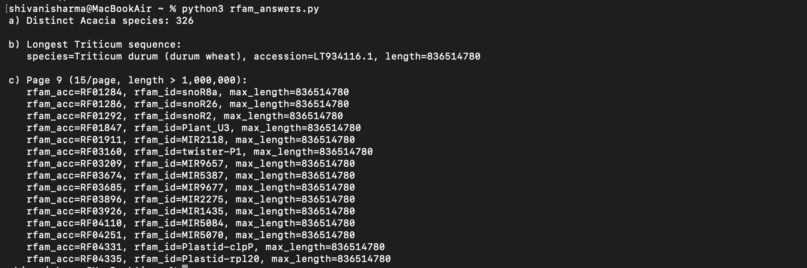

# Rfam SQL Assignment

Answers to three questions against the public Rfam database
(https://docs.rfam.org/en/latest/database.html) using Python + PyMySQL.

## Questions

a) How many types (species) of Acacia plants are in the taxonomy table?

b) Which type of wheat has the longest DNA sequence?

c) Paginate a list of family names and their longest DNA sequence lengths
   (descending), including only families with sequence length greater
   than 1,000,000. Return page 9 at 15 results per page.

## Setup

```bash
pip install -r requirements.txt
python src/rfam_answers.py
```

Connects to the public read-only Rfam MySQL instance
(`mysql-rfam-public.ebi.ac.uk:4497`, user `rfamro`, no password) — no
credentials need to be configured.

## Approach

- **(a)** Filters `taxonomy.species` by the `Acacia` genus prefix and
  counts distinct species names.
- **(b)** Joins `rfamseq` to `taxonomy` on `ncbi_id` to filter sequences
  belonging to genus `Triticum` (wheat), then sorts by `length`
  descending and takes the top result.
- **(c)** Joins `family` → `full_region` → `rfamseq` to compute each
  family's longest matched sequence length, filters with `HAVING` (since
  the length threshold applies to an aggregate), and paginates using
  `LIMIT` / `OFFSET`, where `offset = (page_number - 1) * page_size`.
  `is_significant = 1` is applied on `full_region` to exclude
  low-confidence matches, following Rfam's own documented query
  conventions.

Query parameters (genus names, page number, page size, length threshold)
are passed as arguments to reusable functions rather than hard-coded
inline, so the same functions could answer the same style of question
for a different genus, page, or threshold without modification.

## Results

See `results/sample_output.txt` for full output from a live run.

- a) 326 distinct Acacia species
- b) *Triticum durum* (durum wheat), accession `LT934116.1`,
  length 836,514,780 bp
- c) Page 9 returns 15 families, all sharing the same max matched length
  (836,514,780 bp) — see `results/sample_output.txt` for the full list

## Screenshot



## Project structure

```
rfam-sql-assignment/
├── README.md
├── requirements.txt
├── src/
│   └── rfam_answers.py
└── results/
    └── sample_output.txt
```
